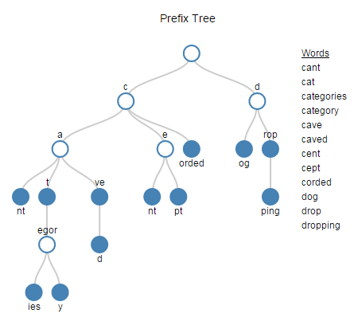

# Overview
This is my adoption to Spark 2.4 of `bin-packing` algorithm initially written in `Clojure` 
by [Silverpond](https://silverpond.com.au/2016/10/06/balancing-spark/) guys.   

Hopefully in a more readable way.  

[Presentation link](https://jsofra.github.io/bin-packing-presentation/)  

## What is inside?
1. Distributed Tf Idf Calculation 
2. Distributed Web Crawling and Html Parsing
3. Bin Packing Partitioner
4. Trie Implementation
5. Window functions

##### `Scala` specific stuff
1. stackable modifiers
2. type aliases
3. rational type
4. mixin dependency injection

## Searching Gutenberg
Given some search terms:  
1. Find the book in each Gutenberg bookshelf that those terms are most important to.
2. Find the Gutenberg bookshelf that those terms are most important to.

# Usage

### Running Locally
1. Run index builder 
```
IndexBuilder --local-mode --limit-bookshelves=3 --limit-ebooks-per-bookshelf=5
```
If `index-directory` isn't defined it will store the calculated index under your working directory `/tfidfIndex/books` path

2. Run search queries
```
ScoreQueryRunner --local-mode --search-query=how to cook dinner for forty large human people
```
Example output:
```
+--------------------------------------+------------------------------------------------------------+---------------------+
|bookshelf                             |title                                                       |similarity_level     |
+--------------------------------------+------------------------------------------------------------+---------------------+
|Children's_Picture_Books_(Bookshelf)  |The Kitten's Garden of Verses                               |0.02580279962925926  |
|Children's_Picture_Books_(Bookshelf)  |Wee Ones' Bible Stories                                     |0.010348733748023626 |
|Animal_(Bookshelf)                    |A Guide for the Study of Animals                            |0.011752931974210944 |
|Animal_(Bookshelf)                    |History of Beasts                                           |0.009199061656556122 |
|Esperanto_(Bookshelf)                 |Esperanto: Hearings before the Committee on Education       |0.010759704224797054 |
|Esperanto_(Bookshelf)                 |A Blind Esperantist's Trip to Finland and Sweden, to Attend |0.009663342432013127 |
|Science_Fiction_(Bookshelf)           |Gourmet                                                     |0.012141218396802425 |
|Science_Fiction_(Bookshelf)           |The Mathematicians                                          |0.0053702401665398115|
|Technology_(Bookshelf)                |How to Prepare and Serve a Meal and Interior Decoration     |0.009392894975053478 |
|Technology_(Bookshelf)                |A plain cookery book for the working classes                |0.005125602053591905 |
+--------------------------------------+------------------------------------------------------------+---------------------+
```
We could see that `Children's_Picture_Books_(Bookshelf)` has the highest similarity level with these two books on top.
`similarity_level` is ordered per bookshelf separately as it is meaningless to compare them across bookshelves.

# Data Skew
  

[Skewed Data](https://blog.clairvoyantsoft.com/optimize-the-skew-in-spark-e523c6ee18ac): Skewness is the statistical 
term, which refers to the value distribution in a given dataset. When we say that data is highly skewed, it means 
some column values have more rows and some very less. E.x. data is not properly/evenly distributed. This affects 
the performance and parallelism in any distributed system.  

Gutenberg library:
 - Inherently skewed data set
 - 228 bookshelves
 - 1 book minimum
 - 1341 book maximum
 - Standard deviation ~ 121


#### How do you know if the computation is suffering from skewed data?
1. Gangila/Grafana metrics  
   
shows uneven distribution of work across the cluster
2. Spark UI
  
199 are finished and waiting for a single task

# Partitioning

#### Partition into exact number of bookshelves
 - Overhead from small tasks
 - Poor scheduling
 - Not enough hardware
 - Unused capacity 
 
To create more balanced computation across the workers maybe we can partition the data into more evenly weighted partitions? 
 
## Packing
The problem roughly falls into a class of optimization problems known as packing problems.  
 - https://en.wikipedia.org/wiki/Packing_problems  

|                                |                       |
| ------------------------------ |:---------------------:|
| Set packing                    | Conway puzzle         | 
| Bin packing problem            | Tetris                |     
| Slothouber-Graatsma puzzle     | Covering problem      |  
| Close-packing of equal spheres | Random close pack     | 
| Tetrahedron packing            | Cutting stock problem |
| Kissing number problem         |                       |

These are NP-hard problems so we will need to make use of heuristical methods or 
possibly a constraint solver.  

#### Bin Packing
   
[image source](http://www.martinbroadhurst.com/bin-packing.html)   
Our problem seems most closely related to the Bin packing problem (minimum number of bins 
of a certain volume) or maybe the Multiprocessor scheduling problem (pack into a specific 
number of bins)  
  
Bin Packing Methods:
1. First Fit (smallest number of fixed sized bins)
2. First Fit + Smallest Bin (fixed number of bins)

Code example
```scala
case class BinPacking[ItemType](packingItems: Map[ItemType, ItemSize]) {
  
  def packNBins(nbins: Int): BinsContainer[ItemType] = pack(sortDecreasing(packingItems), nbins)
  def packMaxCapacity(binMaxCapacity: Int): BinsContainer[ItemType] = firstFit(sortDecreasing(packingItems), binMaxCapacity)
 
  def pack(items: Items, nbins: Int) = firstFit(items)(noFitFn = addToSmallestBin(nbins))
 
  def firstFit(items: Items, maxSize: Long)(implicit noFitFn: (Bins, Bin) => Bins = addNewBinToBins): Bins = {
    val bins = mutable.MutableList[Bin]()
    for (item <- items) {
      selectBin(bins, item, maxSize) match {
        case Some(bin) => bin.add(item)
        case None => noFitFn(bins, MutableBin(item.size, mutable.Set(item.name)))
      }
    }
    bins
  }

  def selectBin(bins: Bins, item: Item, maxSize: Long): Option[MutableBin] = {
    for (bin <- bins) {
      if ((bin.size + item.size) <= maxSize) {
        return Some(bin)
      }
    }
    None
  }
}
```

It helps us to solve the following problems:  
1. Pack into containers of volume V in a way that minimizes the number of bins used  
```
6 groups of people, of group sizes 3,1,6,4,5 and 2 need to fit
onto minibuses with capacity 7 but must stay together in their groups.
Find the number of minibuses need to pack them un efficiently and so that each group stays together
```
Solution:
```scala
it should "pack 6 groups of people, of group sizes 3, 1, 6, 4, 5 and 2 onto minibuses with capacity 7" in {
  //find the number of minibuses need to pack them un efficiently and so that each group stays together
  val groupSizes = Map(1 -> 3L, 2 -> 1L, 3 -> 6L, 4 -> 4L, 5 -> 5L, 6 -> 2L)
  val minibusCapacity = 7

  val packed = BinPacking(groupSizes).packMaxCapacity(minibusCapacity)
  assert(packed.nbins == 3)
  assert(packed.binSizes.equals(List(7L, 7L, 7L)))
}
```

2. Pack into a finite number of bins
```
Pack items into N partitions so that each partition will have to execute almost the same amount of work
```
Solution:
```scala
it should "packNBins into 4 equally sized bins" in {
    val partitons = 4 
    val items: Map[String, Long] = Map("a" -> 1L, "b" -> 4, "c" -> 9, "d" -> 4, "e" -> 1, "f" -> 5,
      "g" -> 8, "h" -> 3, "i" -> 2, "j" -> 5, "k" -> 7, "l" -> 3, "m" -> 2, "n" -> 6)

    val packed = BinPacking(items).packNBins(partitons)

    assert(packed.nbins == partitons)
    assert(packed.binSizes.equals(List(15L, 15L, 15L, 15L)))
}
```

#### Bin Packing Partitioner
All we have to know is a text size aka content-length per ebook, so that we would able to distribute the load more evenly
by mixing small books and big books into an equally sized bins. 
```scala
// compute text sizes
val ebookUrls = bookshelves.mapPartitions(bookshelves => {   
   bookshelves.map(bookshelf => (bookshelf.url, getTotalTextSize(bookshelf)))
})

//relative fast computation as there up to N bookshelves elements
val packingItems = ebookUrls.collect()
val packedUrlsIntoBins = BinPacking(packingItems).packNBins(partitions)

//here the magic comes
ebookUrls.rdd.partitionBy(new BinPackingPartitioner(packedUrlsIntoBins))

case class BinPackingRepartitioner(ebookUrls) {
  repartition(partitions: Int): RDD = {
    val packingItems = ebookUrls.map { case (bookshelf, ebooks) => (bookshelf, ebooks.totalTextSize) }.collect().toMap
    
    val packedUrlsIntoBins = BinPacking(packingItems).packNBins(partitions)    
    ebookUrls.rdd.partitionBy(new BinPackingPartitioner(packedUrlsIntoBins))
  }
}

class BinPackingPartitioner(packedUrls: BinsContainer) extends Partitioner {
  def getPartition(key: Any): Int = key match {
    case null => 0
    case _ => packedUrls.lookupItemIdx(key).get
  }
}
```
# Term Frequency-Inverse Document Frequency
  
  
[TF-IDF](https://www.onely.com/blog/what-is-tf-idf/) is an information retrieval technique that weighs a term’s 
frequency (TF) and its inverse document frequency (IDF). Each word or term has its respective TF and IDF score. 
The product of the TF and IDF scores of a term is called the TF*IDF weight of that term.  
   
For a word to have high tf-idf in a document, it must appear a lot of times in said document and must be absent
in the other documents. It must be a signature word of the document.  
  
Code example
```scala
case class TfIdf[DocId](corpus: Map[DocId, String]) {  
  def calculate() = {
    val (tfs, idf) = calcTfAndIdf
    tfs.mapValues(tf => {
      tf.map { case (term, freqOfTermInDoc) => (term, freqOfTermInDoc * idf.get(term))) }
    })
  }

  def calcTfAndIdf = {
    val idAndTerms = corpus.mapValues(getTerms)
    val tfs = idAndTerms.map {case (id, terms) => (id, tf(terms))}

    val docsCount = corpus.size
    val termDocCounts = idAndTerms
      .flatMap { case (_, terms) => terms.distinct }
      .groupBy(identity) //group by words and count frequencies
      .mapValues(_.size)

    (tfs, idf(docsCount, termDocCounts))
  }

  def idf(nDocs: Long, termDocCounts: Map[String, Int]) = {
    termDocCounts.mapValues(termCount => Math.log(nDocs / (1.0 + termCount)))
  }

  def tf(terms: Stream[String]) = {
    val nTerms = terms.length
    val frequencies = terms.groupBy(identity).mapValues(_.length)
    frequencies.mapValues(calcTf(nTerms))
  }
}
```

Given set of documents
```scala
val docs = Map(
    "doc 1" -> "word1 word1 word2 word3 word4",
    "doc 2" -> "word1 word2 word3 word4 word5",
    "doc 3" -> "word1 word1 word1 word1 word2",
  )
```

1. Calculate terms frequencies
```scala
it should "calculate terms frequencies per document" in {
  val docTfs = TfIdf.tf(docs)

  //doc 1 -> (word1, 0.4), (word2, 0.2), (word4, 0.2), (word3, 0.2)
  //doc 2 -> (word2, 0.2), (word5, 0.2), (word3, 0.2), (word1, 0.2), (word4,0.2)
  //doc 3 -> (word1, 0.8), (word2, 0.2)

  assert(docTfs("doc 1").getTermWeight("word1").equals(0.4))
  assert(docTfs("doc 2").getTermWeight("word1").equals(0.2))
  assert(docTfs("doc 3").getTermWeight("word1").equals(0.8))
}
```

2. Calculate inverse document frequency  
```scala
it should "calculate IDF of a word where idf is the measure of how significant that term is in the whole corpus." in {
  val idfIndex = TfIdf.idf(docs)
  //`word 5` must be the most significant one as it is present only in `doc 2`
  val (mostSignificantTerm, weight) = idfIndex.iterator.maxBy{ case (term, weight) =>  weight}
  assert(mostSignificantTerm == "word5")
}
```

3. Calculate tf-idf for documents
```scala
it should "calculate Tf-Idf aka signature words of the documents" in {
  val tfIdf = TfIdf.calculate(docs)
  val termWeightsIter = tfIdf.getSignatureWordsFor("doc 2").take(1)

  assert(termWeightsIter.next().term == "word5")
}
```

#### Adding Spark into the mix
After we have loaded and distributed all the text for the ebooks, we are ready to calculate Tf-Idf.  
That's it.
```scala
val booksTfIdf = corpus.map {
  case (bookshelfUrl, ebookTexts) => (bookshelfUrl, TfIdf.calculate(ebookTexts))
}
```

## Trie
  
Tries are an extremely special and useful data-structure that are based on the prefix of a string.   
They are used to represent the “Retrieval” of data and thus the name Trie.
  
A Trie is a special data structure used to store strings that can be visualized like a graph. 
It consists of nodes and edges. Each node consists of at max 26 children and edges connect each parent 
node to its children. These 26 pointers are nothing but pointers for each of the 26 letters of the 
English alphabet A separate edge is maintained for every edge.  

Strings are stored in a top to bottom manner on the basis of their prefix in a trie. All prefixes of 
length 1 are stored at until level 1, all prefixes of length 2 are sorted at until level 2 and so on.  

Implementing immutable [Trie](https://medium.com/@AlirezaMeskin/implementing-immutable-trie-in-scala-c0ab58fd401) in Scala
```scala
case class Trie[V](value: Option[V], children: List[Option[Trie[V]]]) {
  def insert(key: String, value: V): Trie[V] = Trie.insert(this, key, value, 0)
  def search(key: String): Option[V] = Trie.search(this, key, 0)
}

object Trie {
  //Each node consists of at max 26 children
  def empty[V]: Trie[V] = new Trie[V](None, List.fill(26)(None))

  private def search[V](node: Trie[V], key: String, step: Int): Option[V] =
    if (key.length == step) {
      node.value
    } else {
      node.children(key.charAt(step) - 32) match {
        case Some(nextItem) => search(nextItem, key, step + 1)
        case None           => None
      }
    }

  private def insert[V](node: Trie[V], key: String, value: V, step: Int): Trie[V] =
    if (key.length == step) {
      node.copy(value = Some(value))
    } else {
      val index    = key.charAt(step) - 97
      val nextItem = node.children(index).getOrElse(Trie.empty[V])
      val newNode  = insert(nextItem, key, value, step + 1)
      val newNext  = node.children.updated(index, Some(newNode))
      node.copy(children = newNext)
    }
}
```
## Scala Features
Mixin dependency injection and Stackable modifiers
```scala
object gutenbergRepository extends GutenbergRepository {
  val gutenbergLibrary = new GutenbergLibrary with ThroughFileReader
}
```

#### Stackable Modifiers
The `ThroughFileReader` trait has two funny things going on.   
  
The first is that it declares a superclass, EbooksLibrary. This declaration means that the trait can 
only be mixed into a class that also extends EbooksLibrary. 
   
The second funny thing is that the trait has a super call on a method declared abstract. Such calls are illegal
for normal classes because they will certainly fail at run time. For a trait, however, such a call can actually
succeed. Since super calls in a trait are dynamically bound, the super call in trait ThroughFileReader will 
work so long as the trait is mixed in after another trait or class that gives a concrete definition to the method.
```scala
trait ThroughFileReader extends EbooksLibrary {
  abstract override def getBookshelvesWithEbooks: Seq[Bookshelf] = {
    ...
  }
}
```
#### Build in Dependency injection
With Scala you have some alternatives enabled by the language itself
  
```scala
class GutenbergRepository extends EbooksRepository  {
  val gutenbergLibrary: GutenbergLibrary //depends on
}
```
  
Usage
```scala
object gutenbergRepository extends GutenbergRepository {
  val gutenbergLibrary
}

val bookshelves: Dataset[Bookshelf] = gutenbergRepository.getBookshelves
```

## Window functions
`TfIdf` index is calculated only for the books within bookshelf. 
We can't compare two books from two different bookshelves, so we need a way to range results
firstly be the most fitting bookshelf and then order the books by similarity within each bookshelf.  
  
`ScoreQueryRunner` uses `window` functions functionality to achieve this requirement.
   
 1. Calculate similarity level for each book by summing terms weighs
```scala
ebooks
   .where($"term".isin(TfIdf.getTerms(query): _ *))
   .groupBy($"bookshelf_url", $"ebook_id", $"ebook_title")
   .agg(sum($"weight").as("similarity_level"))
``` 
 2. Rank each book within bookshelf from the most similar to the least 
```scala
val similarityLevelWindow = Window.partitionBy($"bookshelf_url").orderBy($"similarity_level".desc)
similarBooks
  .select(rank().over(orderedBySimilarityLevelWindow).as("topN"))
``` 

 3. Get the total similarity level per bookshelf. Note the absence of in `orderBy`. 
```scala
val bookshelvesWindow = Window.partitionBy($"bookshelf_url")
similarBooks
.select(sum($"similarity_level").over(bookshelvesWindow).as("bookshelfSimilarityLevel"))
```
 4. Finally get the final result
```scala
similarBooks
 .orderBy($"bookshelfSimilarityLevel".desc, $"bookshelf_url", $"topN")
 .select($"bookshelf_url", $"title", $"similarity_level")
```

## Dataset partitioner
TODO